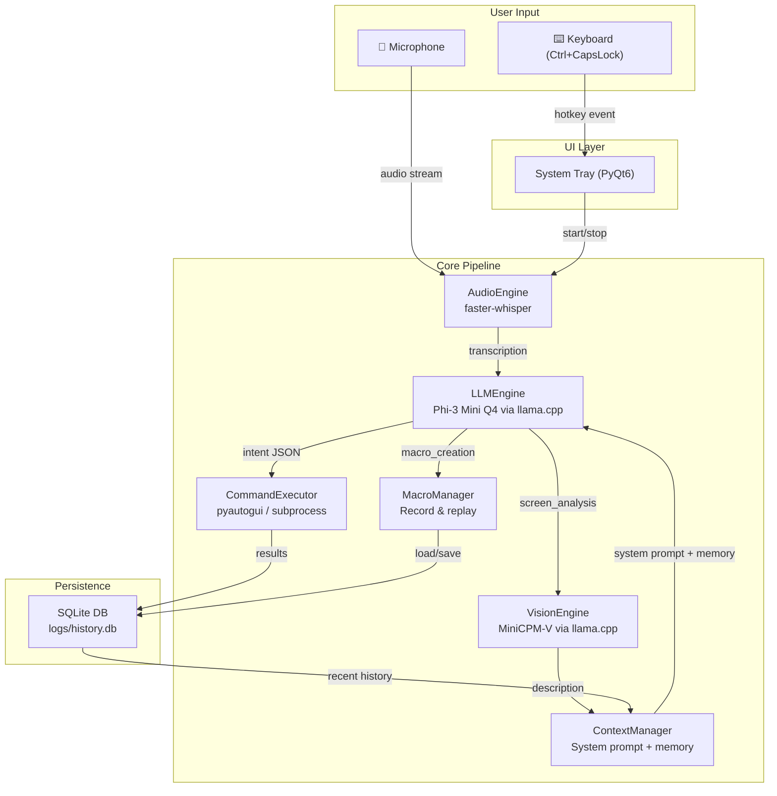
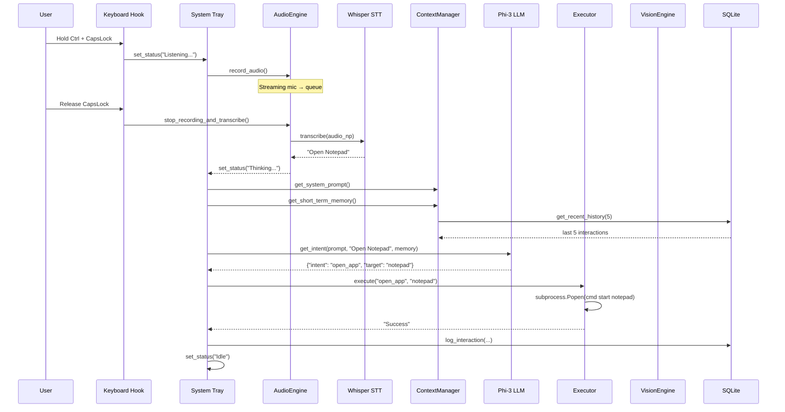

# Trixie Assistant — Deep Project Analysis

## 1. Executive Summary

**Trixie** is a **fully local, voice-controlled desktop AI assistant** for Windows. It captures voice via push-to-talk, transcribes it locally with Whisper, classifies the user's intent through a local LLM (Phi-3 Mini), and executes desktop actions — opening/closing apps, typing, hotkeys, running scripts, capturing & analyzing the screen with a multimodal vision model, and recording/replaying custom macros.

Everything runs **100% offline** with no cloud dependencies. Total model weight: **~7.8 GB** on disk.

---

## 2. Architecture Overview

---

## 3. File-by-File Breakdown

### 3.1 Entry Point — [main.py](file:///c:/Users/Felix/Desktop/Trixie/main.py)

| Aspect | Detail |
|---|---|
| **Class** | `TrixieApp` — orchestrates the entire lifecycle |
| **Init** | Loads `config.json`, instantiates all 7 subsystems |
| **Hotkey** | `keyboard.hook_key('caps lock', ...)` with Ctrl modifier → push-to-talk |
| **Flow** | `start_listening()` → `stop_listening_and_process()` → spawns `process_command()` in a daemon thread |
| **Intent dispatch** | Routes on `intent` string: `open_app`, `close_app`, `run_script`, `string_type`, `hotkey`, `delay`, `screen_analysis`, `macro_creation`, `general_query` |

### 3.2 Audio — [core/audio.py](file:///c:/Users/Felix/Desktop/Trixie/core/audio.py)

- **Library**: `sounddevice` for recording, `faster-whisper` (CTranslate2) for STT.
- **Config**: 16 kHz, mono, float32. Whisper model: `tiny.en`, int8 quantized, auto device.
- **Flow**: Opens an `InputStream` with a callback that pushes chunks to a `queue.Queue`. On stop, concatenates all chunks → `np.flatten()` → `model.transcribe(beam_size=5)`.
- **Lazy loading**: Model loads on first transcription, not at startup.

### 3.3 LLM Engine — [core/llm_engine.py](file:///c:/Users/Felix/Desktop/Trixie/core/llm_engine.py)

- **Model**: `Phi-3 Mini 4K Instruct` (Q4 GGUF, ~2.4 GB).
- **Backend**: `llama-cpp-python` with `n_gpu_layers=-1` (auto GPU offload).
- **Prompt format**: Phi-3 chat template (`<|system|>`, `<|user|>`, `<|assistant|>`).
- **Inference**: `max_tokens=150`, `temperature=0.1` (near-deterministic).
- **Output parsing**: Scans for first `{...}` JSON block; falls back to `general_query` on failure.
- **Lazy loading**: Model loads on first `get_intent()` call.

### 3.4 Vision Engine — [core/vision_engine.py](file:///c:/Users/Felix/Desktop/Trixie/core/vision_engine.py)

- **Model**: `MiniCPM-V 2.5` (Q4 int4, ~4.6 GB) + projection file (~1.0 GB).
- **Backend**: `llama-cpp-python` with `Llava15ChatHandler` for multimodal chat.
- **Screen capture**: `mss` grabs primary monitor → PIL resize to 1024×1024 max → JPEG base64.
- **Inference**: Sends image + text query via `create_chat_completion()`, 256 max tokens.
- **Lazy loading**: Model loads on first `analyze_screen()` call.

### 3.5 Context Manager — [core/context.py](file:///c:/Users/Felix/Desktop/Trixie/core/context.py)

- **System prompt**: Hard-coded role description + few-shot JSON examples for intent classification.
- **Short-term memory**: Pulls last 5 interactions from DB, formats as `User: ... / Assistant Intent: ...` pairs.
- **Screen context**: Stored as a text field (`active_screen_context`), set after vision analysis.

> [!WARNING]
> `active_screen_context` is set but **never injected** into the LLM prompt — the vision result is stored but effectively unused for follow-up reasoning.

### 3.6 Command Executor — [core/executor.py](file:///c:/Users/Felix/Desktop/Trixie/core/executor.py)

| Action | Implementation |
|---|---|
| `open_app` | `cmd.exe /c start {target}` via `subprocess.Popen` |
| `close_app` | `taskkill /IM {target}.exe /F` |
| `run_script` | `python {target}` via `subprocess.Popen` |
| `string_type` | `pyautogui.write(target, interval=0.05)` |
| `hotkey` | Splits on `+`, calls `pyautogui.hotkey(*keys)` |
| `delay` | `time.sleep(float(target))` |

- **Safety**: `pyautogui.FAILSAFE = True` (move mouse to corner to abort), `PAUSE = 0.5s`.
- **Macro support**: `execute_macro()` iterates a list of `{action, target}` dicts, aborts on first failure.

### 3.7 Macro Manager — [core/macro_manager.py](file:///c:/Users/Felix/Desktop/Trixie/core/macro_manager.py)

- **Storage**: SQLite `macros` table with `name`, `voice_trigger`, `hotkey`, `actions_json`.
- **Auto-derivation**: `create_macro_from_history()` pulls the last N interactions, filters out non-executable intents, and saves them as a replayable sequence.
- **Hotkey binding**: Uses `keyboard.add_hotkey()` for system-wide macro triggers, runs in daemon threads.
- **Boot loading**: All saved macros are registered on `MacroManager.__init__()`.

### 3.8 Database — [core/db.py](file:///c:/Users/Felix/Desktop/Trixie/core/db.py)

- **Engine**: SQLite3, `check_same_thread=False` for cross-thread access.
- **Tables**: `history` (interaction log) + `macros` (saved macros).
- **Singleton issue**: A module-level `db = DBManager()` is instantiated at import time (line 91), separate from the instance created in `main.py`.

### 3.9 UI — [ui/app.py](file:///c:/Users/Felix/Desktop/Trixie/ui/app.py)

- **Framework**: PyQt6 system tray icon.
- **Features**: Blue 32×32 placeholder icon, context menu (status, push-to-talk shortcut, quit), balloon notifications.
- **Thread safety**: Uses `pyqtSignal` for cross-thread status updates.

---

## 4. Tooling & DevOps

| Script | Purpose |
|---|---|
| [install.py](file:///c:/Users/Felix/Desktop/Trixie/install.py) | Smart installer: detects GPU via WMIC → compiles `llama-cpp-python` with CUDA/Vulkan/CPU flags |
| [download_models.py](file:///c:/Users/Felix/Desktop/Trixie/download_models.py) | Downloads 3 GGUF model files (~7.5 GB) from HuggingFace with progress bar |
| [package.py](file:///c:/Users/Felix/Desktop/Trixie/package.py) | PyInstaller one-file EXE build with hidden imports |
| [config.json](file:///c:/Users/Felix/Desktop/Trixie/config.json) | Model paths, Whisper device/compute config |

---

## 5. Strengths

1. **True offline privacy** — Zero cloud calls, all inference local. Strong selling point.
2. **Hardware-adaptive installer** — Auto-detects NVIDIA/AMD/Intel and compiles for CUDA, Vulkan, or CPU.
3. **Lazy model loading** — Models load on first use, not at boot, saving startup time when features aren't needed.
4. **Macro system** — Genuinely useful: auto-derives replayable action sequences from history, binds to hotkeys.
5. **Modular architecture** — Clean separation of concerns across 7 single-responsibility modules.
6. **Vision capability** — Full screen analysis via multimodal VLM is an impressive feature for a local assistant.
7. **Thread-safe design** — Processing runs in daemon threads, UI updates via Qt signals.

---

## 6. Issues & Improvement Opportunities

### 🔴 Critical

| # | Issue | Location | Detail |
|---|---|---|---|
| 1 | **DB singleton leak** | [db.py:91](file:///c:/Users/Felix/Desktop/Trixie/core/db.py#L91) | `db = DBManager()` creates a rogue instance at import time that opens a DB connection, separate from the one `main.py` creates. This wastes resources and could cause conflicts. |
| 2 | **Shell injection risk** | [executor.py:26](file:///c:/Users/Felix/Desktop/Trixie/core/executor.py#L26) | `subprocess.Popen(["cmd.exe", "/c", "start", target], shell=True)` — the `target` comes directly from LLM output with no sanitization. A hallucinated or adversarial target like `& del /q C:\*` would execute. |
| 3 | **Screen context is dead code** | [context.py:27-31](file:///c:/Users/Felix/Desktop/Trixie/core/context.py#L27-L31) | `set_screen_context()` stores the vision result, but nothing ever reads `active_screen_context` to include it in subsequent prompts. |

### 🟡 Moderate

| # | Issue | Location | Detail |
|---|---|---|---|
| 4 | **No `macro_execution` handler** | [main.py:88](file:///c:/Users/Felix/Desktop/Trixie/main.py#L88) | The system prompt lists `macro_execution` as a valid intent, but `process_command()` has no branch for it — it would silently do nothing. |
| 5 | **README hotkey mismatch** | [README.md:46](file:///c:/Users/Felix/Desktop/Trixie/README.md#L46) | README says "Hold the `Pause/Break` key" but code uses `Ctrl + CapsLock`. |
| 6 | **Nested JSON parsing fragile** | [llm_engine.py:51-61](file:///c:/Users/Felix/Desktop/Trixie/core/llm_engine.py#L51-L61) | Uses `find('{')` / `find('}')` — will break on nested JSON or multiple JSON objects in the output. |
| 7 | **No TTS / response feedback** | [main.py:109-111](file:///c:/Users/Felix/Desktop/Trixie/main.py#L109-L111) | `general_query` intent only logs the response; the user never sees/hears it. No text-to-speech or notification. |
| 8 | **PyInstaller `--add-data` separator** | [package.py:21-22](file:///c:/Users/Felix/Desktop/Trixie/package.py#L21-L22) | Uses `:` as separator (`core:core`), but Windows requires `;` (`core;core`). This would fail on the target OS. |

### 🟢 Minor / Polish

| # | Issue | Detail |
|---|---|---|
| 9 | **No `.gitignore`** | `venv/`, `__pycache__/`, `models/`, `logs/`, `dist/`, `build/` would all get committed |
| 10 | **No error recovery on audio** | If the microphone is unavailable, `sd.InputStream()` throws and crashes |
| 11 | **Placeholder icon** | Blue 32×32 pixmap — should be a proper `.ico` asset |
| 12 | **Missing `__init__.py`** | `core/` and `ui/` lack `__init__.py` (works due to implicit namespace packages, but explicit is better) |
| 13 | **Config not passed to DB** | `main.py` loads `config.json` with `db_path` but never passes it to `DBManager()` — it always uses the default path |

---

## 7. Data Flow — Full Lifecycle

---

## 8. Model Inventory

| Model | File | Size | Purpose | Quantization |
|---|---|---|---|---|
| Phi-3 Mini 4K Instruct | `phi-3-mini-4k-instruct-q4.gguf` | 2.23 GB | Intent classification & NLU | Q4 |
| MiniCPM-V 2.5 | `minicpm-v-2_5-int4.gguf` | 4.58 GB | Multimodal screen analysis | INT4 |
| MiniCPM-V Projection | `mmproj-model-f16.gguf` | 1.02 GB | Vision→text projection layer | FP16 |
| Whisper tiny.en | *(auto-downloaded)* | ~75 MB | Speech-to-text | INT8 (CTranslate2) |

**Total disk footprint**: ~7.9 GB

---

## 9. Verdict

Trixie is a **well-structured, privacy-first local AI assistant** with a solid foundation. The modular design, lazy loading, and hardware-adaptive installer show thoughtful engineering. The macro system is genuinely novel for a project at this stage.

The main gaps are:
- **Security**: Unsanitized LLM output going directly to shell commands
- **Dead code**: Vision context captured but never used in follow-up prompts  
- **Missing features**: No TTS response, no macro execution handler, no error recovery
- **Polish**: Placeholder icon, README/code hotkey mismatch, PyInstaller path separator wrong for Windows

With those addressed, this is a very compelling local-first desktop assistant.
